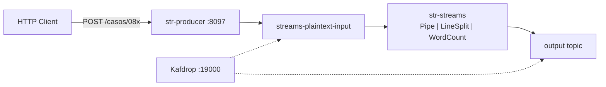
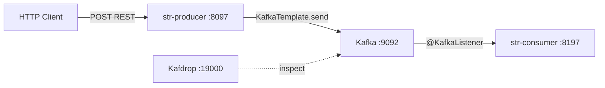
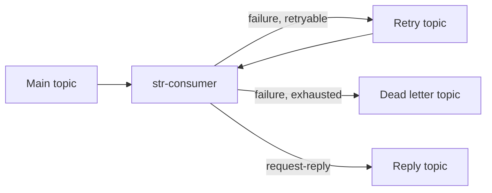
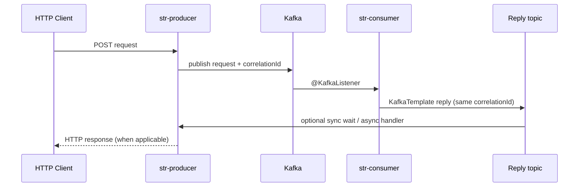

Architecture of my **str-producer / str-consumer** Spring Boot laboratory.

## Components and ports

| Service | Port | Role |
|---------|------|------|
| str-producer | 8097 | REST ingress → Kafka |
| Kafka broker | 9092 | Message log |
| str-consumer | 8197 | Kafka → processing (`@KafkaListener`) |
| str-streams | — | Kafka Streams topologies (Case 08) |
| Kafdrop | 19000 | Web UI to inspect topics |

## Normal flow (Cases 01–07)

Business ingress is **HTTP → Kafka → consumer**. The producer is the only service that accepts external HTTP for publishing lab messages.

## Case 08 flow (Kafka Streams)

For stream processing, **str-streams** replaces the Spring consumer. HTTP still goes only to the producer.



Run **one** Streams app at a time. See [Kafka Streams tutorial post](/kafka/apache-kafka-streams-pipe-linesplit-wordcount/).

## Normal flow diagram (Cases 01–07)



### Producer responsibility

- Receives HTTP (REST controller)
- Serializes payload (String or JSON depending on lab)
- Publishes to the target topic via `KafkaTemplate`

### Consumer responsibility

- Subscribes with `@KafkaListener`
- Runs domain logic: log, transform, filter, persist to DB (lab 07)
- Does **not** replace the producer as the main HTTP entry point

## Important exception: KafkaTemplate in the consumer

The consumer may also use `KafkaTemplate`. That does **not** make it the primary business producer.

Typical infrastructure uses in **str-consumer**:

| Use case | Why |
|----------|-----|
| Retry topic | Republish failed records for backoff retry |
| DLT | Forward poison messages after retries exhausted |
| Request-reply | Send correlated reply to a reply topic |



Lab **04** covers retry + DLT. Lab **05** covers request-reply.

## Request-reply flow



Correlation ID links the reply record to the original request.

## Lab map

| Lab | Flow highlight |
|-----|----------------|
| 01 Basic message | Producer REST → topic → listener logs |
| 02 Message key | Key chooses partition; order per key |
| 03 JSON events | Typed JSON serialization |
| 04 Retry + DLT | Failure → retry topic → DLT |
| 05 Request-reply | correlationId + reply topic |
| 06 Filter / interceptor | `RecordInterceptor` before listener |
| 07 Inventory / DB | Consumer persists side effect |

## Try it yourself (labs)

For each lab, verify:

1. HTTP request to producer **8097** returns expected status
2. Message appears in Kafdrop (**19000**) on the correct topic
3. Consumer logs or DB reflect processing on **8197**

Operational setup (JDK 17, Maven, Windows/JEnv) belongs in separate runbooks — not mixed with these concepts. See [Concepts I Learned](/kafka/apache-kafka-concepts-i-learned/) for definitions.

## Mental model

```
HTTP Client
     |
     v
Producer :8097   ← only main HTTP ingress for publishing
     |
     v
Kafka :9092
     |
     v
Consumer :8197   ← processing; may use KafkaTemplate for retry/DLT/reply only
```

## Related

- [Apache Kafka — Concepts I Learned](/kafka/apache-kafka-concepts-i-learned/)
- [Learning hub](/learning/)
