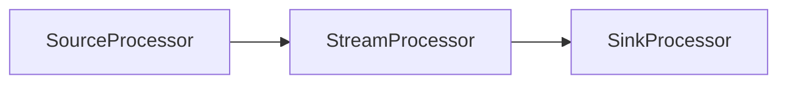
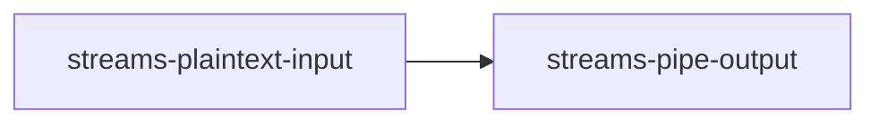
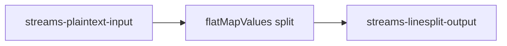
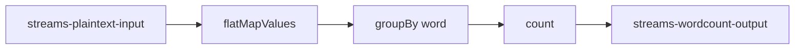

Case **08** in my lab, aligned with the [official Kafka Streams tutorial](https://kafka.apache.org/documentation/streams/).

**Module:** `str-streams/` (plain Java, `KafkaStreams` + `main()` — not Spring Boot).

---

## Spring Kafka vs Kafka Streams

| | Casos 01–07 | Caso 08 |
|---|-------------|---------|
| API | `KafkaTemplate`, `@KafkaListener` | `StreamsBuilder`, `KStream`, `KTable` |
| Model | Message in → handler | **Topology** of processors |
| Runtime | str-consumer :8197 | str-streams (separate process) |
| HTTP ingress | str-producer :8097 | str-producer :8097 (same rule) |

---

## Topology basics

A **topology** is a graph of stream processors:

- **Source processor** — reads from Kafka topics
- **Stream processor** — transforms records (map, filter, flatMap, aggregate)
- **Sink processor** — writes to Kafka topics



Each app has a unique `APPLICATION_ID` (consumer group for Streams).

---

## Case 08a — Pipe (stateless passthrough)

**Topology:** `streams-plaintext-input` → `streams-pipe-output`



```java
builder.stream("streams-plaintext-input").to("streams-pipe-output");
```

**Run:** `run-streams-pipe.bat`  
**Publish:** `POST /casos/08a-pipe`

### KStream

**Definition:** An unbounded, ordered, replayable sequence of key-value records.

**Why it matters:** The core abstraction for stream processing in Kafka Streams.

**In my project:** `builder.stream(StreamsTopics.INPUT)` in all three apps.

**Interview version:** A KStream represents a continuously updating data set from a Kafka topic, processed record by record.

---

## Case 08b — LineSplit (flatMapValues)

**Topology:** split text into words → `streams-linesplit-output`



```java
source.flatMapValues(value -> Arrays.asList(value.split("\\W+")))
      .to("streams-linesplit-output");
```

**Run:** `run-streams-linesplit.bat`  
**Publish:** `POST /casos/08b-linesplit`

One input line can produce **multiple** output records (1 → N).

---

## Case 08c — WordCount (stateful aggregation)

**Topology:** split → lowercase → groupBy word → count → KTable changelog → output



```java
source.flatMapValues(value -> Arrays.asList(value.toLowerCase().split("\\W+")))
      .groupBy((key, value) -> value)
      .count(Materialized.as("counts-store"))
      .toStream()
      .to("streams-wordcount-output", Produced.with(Serdes.String(), Serdes.Long()));
```

**Run:** `run-streams-wordcount.bat`  
**Publish:** `POST /casos/08c-wordcount`

### KTable

**Definition:** A changelog stream where each key maps to the latest value (table view of a stream).

**Why it matters:** Enables aggregations, joins, and materialized state.

**In my project:** `.count()` returns a `KTable<String, Long>` backed by state store `counts-store`.

**Interview version:** A KTable is the table view of a stream — updates overwrite prior values per key, ideal for counts and aggregates.

### State Store

**Definition:** Embedded key-value storage inside the Streams app for stateful operations.

**Why it matters:** Fault-tolerant local state for windowed joins and aggregations.

**In my project:** `counts-store` in WordCount; visible in `topology.describe()`.

**Interview version:** State stores let Kafka Streams persist aggregation state locally with changelog backup to Kafka.

### APPLICATION_ID

**Definition:** Unique identifier for a Streams application instance group.

**Why it matters:** Kafka uses it for consumer groups, offset commits, and rebalancing.

**In my project:** `streams-pipe`, `streams-linesplit`, `streams-wordcount` — run **one at a time**.

**Interview version:** APPLICATION_ID is like a consumer group ID for Streams — it defines who shares state and offsets.

---

## Startup order (Case 08)

```
1. docker compose up -d
2. run-streams-<pipe|linesplit|wordcount>.bat   (pick ONE)
3. run-producer.bat
4. curl /casos/08a|08b|08c
5. Inspect output topic in Kafdrop :19000
```

The consumer (8197) is **not required** for Case 08.

---

## Stream-table duality (brief)

- A **stream** is a sequence of events
- A **table** is the latest value per key
- Aggregations like `count()` produce a **KTable** changelog stream

---

## Processing guarantees (brief)

Kafka Streams supports `at_least_once` (default) and `exactly_once` via `processing.guarantee`. This lab uses defaults; production apps may enable exactly-once for critical pipelines.

---

## Related

- [Try it yourself (cURL)](/kafka/kafka-lab-try-it-yourself/)
- [Lab architecture](/kafka/apache-kafka-lab-architecture/)
- [Concepts](/kafka/apache-kafka-concepts-i-learned/)
- [Windows setup](/kafka/lab-setup-windows/)
